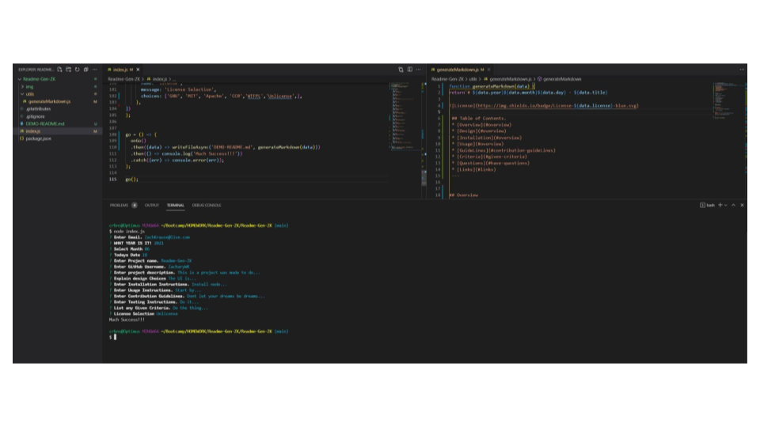

# 20210618 - Readme-Gen-ZK 


 ## Table of Contents.
 * [Overview](#overview)
 * [Design](#overview)
 * [Installation](#overview)
 * [Usage](#overview)
 * [GuideLines](#overview)
 * [Criteria](#given-criteria)
 * [Questions](#have-questions)
 * [Links](#links)
---


## Overview 
    This is a project that uses the terminal to generate a readme based on the users input.

## Design


    Designed with myself as the intended user, default answers are provided to help expedite 
    the readme creation process but also act as examples of what to enter should others wish to use it.

## Installation Instructions
    Install node, download the Readme-Gen-ZK directory, then use the terminal to install inquirer (npm i inquirer)

## Usage Instructions
    Open Terminal, navigate to location of Readme-Gen-ZK/index.js, and use node to run index.js

---
## Given Criteria
* Must be a command-line application that accepts user input that creates a readme mark down file. 
* User must be able to provide input for; Github user name, Project title, Description, Installation, Usage, License, Contributing, and Testing.
* User may select a license and have the badge for that license be displayed in the readme.
* User input must be displayed in the corresponding section of the readme.
* Provide a link to the users github profile.
* Have a questions section with my contact information
* Have a table of contents that links to the corresponding section of the readme.


---
## Have Questions
### You can contact me at:

GITHUB: <https://github.com/ZacharyWK>

### or

EMAIL: <ZachKrause@live.com>


## Links
[REPOSITORY](https://github.com/ZacharyWK/Readme-Gen-ZK)
```
https://github.com/ZacharyWK/Readme-Gen-ZK
```

[WALKTHROUGH](https://github.com/ZacharyWK/Readme-Gen-ZK/blob/main/Readme-Gen-ZK.webm)
```
https://github.com/ZacharyWK/Readme-Gen-ZK/blob/main/Readme-Gen-ZK.webm
```
